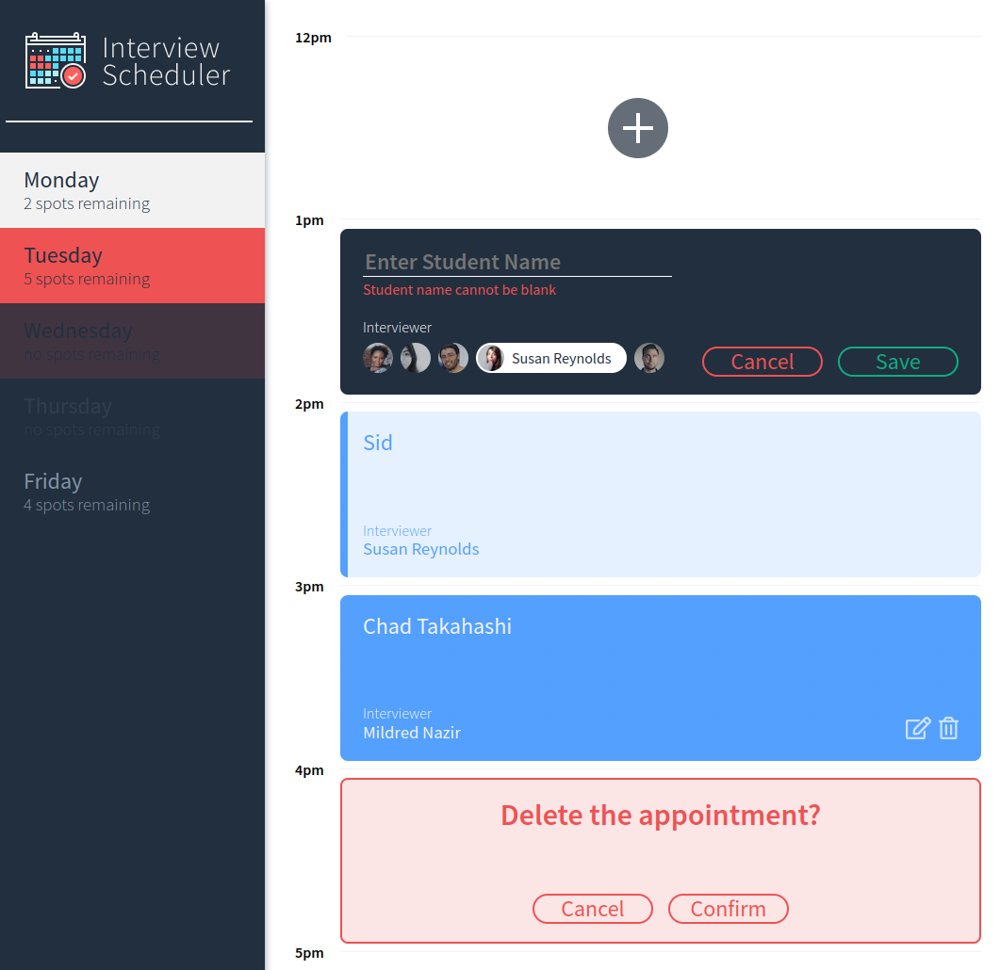

# Interview Scheduler

<!-- ABOUT THE PROJECT -->
## About The Project

A dynamic single page website where users can create, edit, and delete scheduled appointments.

---

## Setup

Required
- node
- npm

1. Clone the repository
```sh
git clone git@github.com:sidnat/scheduler.git
```
2. Install dependencies with 
```sh
npm install`.
```
3. Run Webpack Development Server, this will start the website (http://localhost:8000/)
```sh
npm start
```
4. Running Jest Test Framework
```sh
npm test
```
5. Running Storybook Visual Testbed
```sh
npm run storybook
```

---

## Screenshot

Screenshot



---

## Guide with steps

1. select a day with available appointments, upon clicking the day will be highlighted in white.

2. hovering over any day with available spots will be highlighted in bright red.

3. any days that are fully booked will be greyed out, and hovering over will highlight in dull red.

4. click the add '+' appointment button.

5. complete the form by entering the student name and selecting an interviewer. if either the student name or interviewer is missing you will receive an error message.

6. upon saving an appointment, you will be presented with an appointment card showing your name and the interviewers name.

7. Should you want to edit or delete an existing appointment, you can do so by hovering over the appointment card and click either the notepad or trash bin icon.

8. Upon clicking the notepad icon, you will be presented with the same form where you can enter your name and select an interviewer.

8. Upon clicking the trash bin icon, you will be asked to confirm whether you would like to delete the appointment. Once you are sure you may click "Confirm"